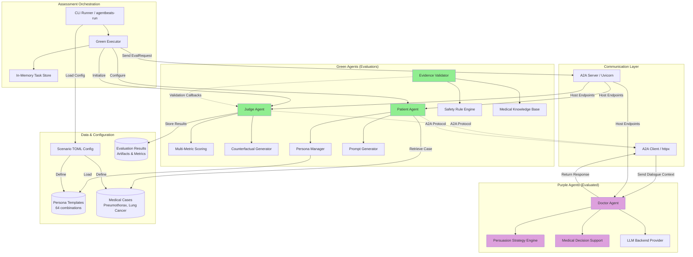
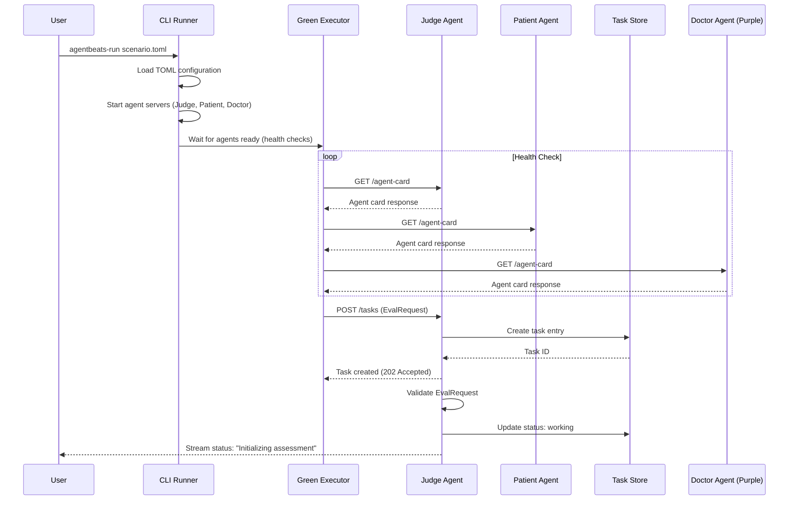
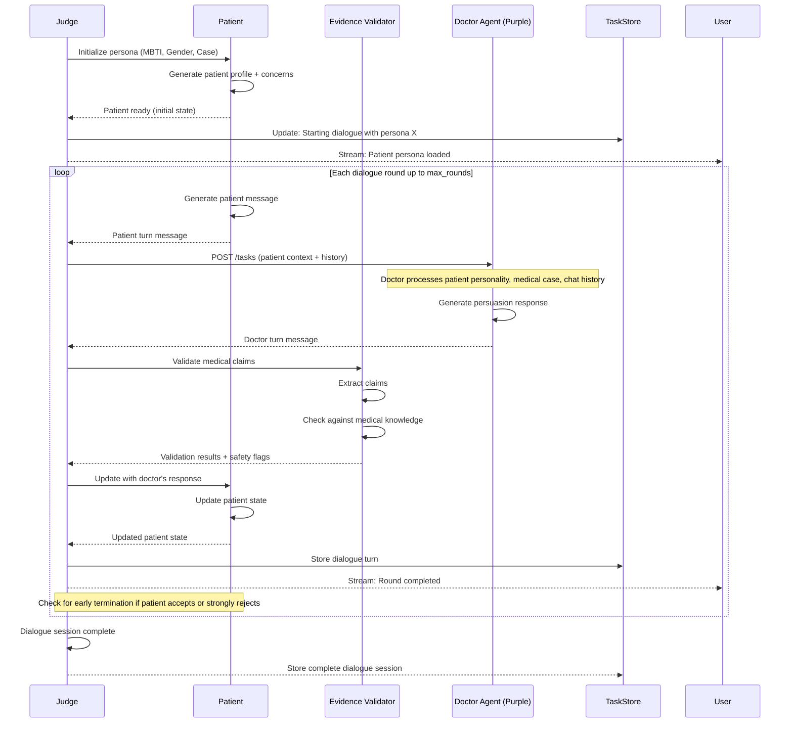
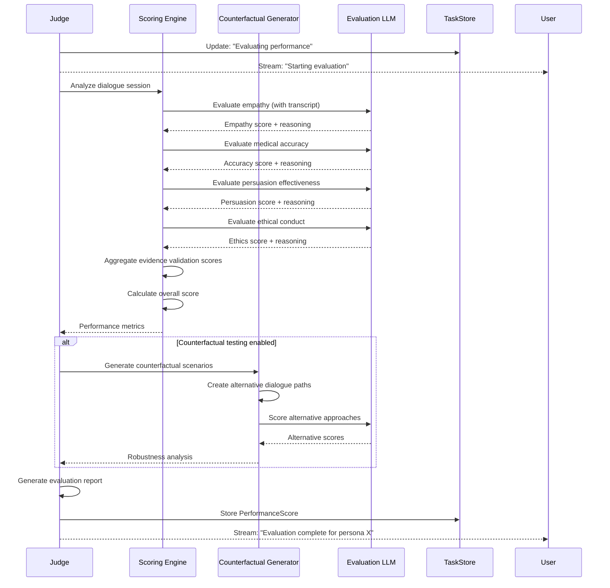
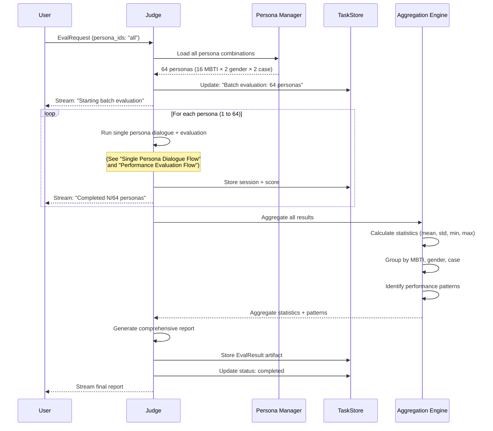

# GAA: Generative Adversarial Agents for Safe Medical Dialogue (OSEC Project)

### Table of Contents

1. [System Overview](#system-overview)
2. [Technical Architecture](#technical-architecture)
3. [Functional Requirements](#functional-requirements)
4. [Data Models](#data-models)
5. [System Architecture Diagram](#system-architecture-diagram)
6. [API Flow Diagrams](#api-flow-diagrams)
7. [Component Specifications](#component-specifications)
8. [Repository Layout](#repository-layout)
9. [Evaluation Setup Guide](#evaluation-setup-guide)

---

# 1. System Overview

The GAA (Generative Adversarial Agents) system is a multi-agent adversarial framework designed for safe, auditable medical AI evaluation. It evaluates doctor agents' ability to persuade patients to accept surgical treatment across diverse patient personas and medical conditions.

```
Green Agent (Evaluator) generates patient persona → Purple Agent (Doctor) receives patient context + chat history → 
Doctor responds with persuasion strategy → Patient Agent evaluates response and continues dialogue → 
Multiple rounds of interaction → Judge Agent scores doctor's performance → 
Results stored and analyzed across 64 persona-case combinations
```

Key Value Propositions:
- Systematic evaluation of medical dialogue agents across diverse patient personas (16 MBTI types × 2 genders × 2 medical conditions)
- Multi-agent adversarial framework ensuring robust safety and consistency validation
- Auditable evidence-based evaluation with counterfactual testing capabilities
- Standardized A2A protocol integration for reproducible benchmarking

System Characteristics:
- Multi-agent system with clear separation between evaluator (green) and evaluated (purple) agents
- Green agents: Patient simulator with persona management + Judge for multi-metric scoring + Evidence validator
- Purple agents: Doctor agents with persuasion strategies and medical decision support
- Evaluation state managed in-memory during assessment sessions
- Results persisted as structured artifacts with detailed scoring metrics
- All agent communication via A2A protocol for interoperability

---

# 2. Technical Architecture

| Layer                | Technology / Tool     | Purpose                                      | Version Requirement |
| -------------------- | --------------------- | -------------------------------------------- | ------------------- |
| Agent Protocol       | A2A SDK               | Standardized agent-to-agent communication    | 0.3.5+              |
| Agent Framework      | Google ADK            | Agent development and orchestration          | 1.14.1+             |
| Language Models      | LiteLLM               | Multi-provider LLM access (OpenAI, Azure)    | 1.0.0+              |
| Green Agent Runtime  | Python + Uvicorn      | Evaluator agent server and orchestration     | 3.11+               |
| Purple Agent Runtime | Python + Uvicorn      | Doctor agent server and dialogue management  | 3.11+               |
| Data Validation      | Pydantic              | Type-safe data models and validation         | 2.11.9+             |
| Async Processing     | asyncio + httpx       | Concurrent agent communication               | -                   |
| Configuration        | TOML                  | Scenario and agent configuration             | -                   |
| Persona Management   | JSON templates        | Patient persona generation and storage       | -                   |
| Evidence Validation  | Rule-based + LLM      | Medical dialogue safety and accuracy checks  | -                   |
| Scoring System       | Multi-metric pipeline | Persuasion effectiveness evaluation          | -                   |
| Task Management      | InMemoryTaskStore     | Assessment state tracking                    | -                   |
| Deployment           | Local processes       | Multi-agent orchestration via CLI            | -                   |

---

# 3. Functional Requirements

## Feature: Patient Persona Generation

Trigger Conditions:
- Assessment request initiated by green agent
- Specific persona combination selected (MBTI × Gender × Medical Case)

Behavior:
- Generate patient background with personality traits
- Load medical case context (pneumothorax or lung cancer)
- Initialize patient state with resistance level and concerns
- Create prompt template for patient dialogue management

Input Requirements:
- MBTI personality type (16 types)
- Gender (male/female)
- Medical condition (pneumothorax/lung cancer)
- Optional: Custom persona parameters

Output Requirements:
- Structured patient profile with personality traits
- Medical case description
- Initial patient concerns and resistance factors
- Dialogue prompt template

Error Handling:
- Invalid persona parameters → Use default persona
- Missing medical case data → Return error and abort assessment

User Interaction:
- None (automated persona generation)

Dependencies:
- Persona template library
- Medical case database
- Prompt generation system

---

## Feature: Doctor-Patient Dialogue Orchestration

Trigger Conditions:
- Assessment starts with valid purple agent (doctor) endpoint
- Patient persona initialized

Behavior:
- Initialize dialogue with patient presenting symptoms
- Send patient context + chat history to doctor agent
- Receive doctor's response
- Update patient state based on doctor's persuasion attempt
- Continue for configured number of rounds or until patient accepts/rejects surgery

Input Requirements:
- Doctor agent endpoint
- Number of dialogue rounds (default: 5)
- Patient persona configuration
- Medical case details

Output Requirements:
- Complete dialogue transcript
- Patient state evolution over time
- Doctor's persuasion strategies used
- Final outcome (acceptance/rejection/neutral)

Error Handling:
- Doctor agent timeout → Retry with backoff, terminate after 3 failures
- Invalid doctor response format → Request reformatted response
- Patient agent error → Log and continue with default patient response

User Interaction:
- Real-time streaming of dialogue progress (optional)
- Progress indicators during multi-round assessment

Dependencies:
- Purple agent (doctor) A2A server
- Patient agent with prompt manager
- Dialogue state management
- A2A messaging client

---

## Feature: Multi-Metric Performance Evaluation

Trigger Conditions:
- Dialogue session completed (all rounds finished or early termination)

Behavior:
- Analyze complete dialogue transcript
- Score doctor performance across multiple dimensions:
  - Empathy and emotional support
  - Medical accuracy and evidence presentation
  - Persuasion effectiveness
  - Ethical considerations and informed consent
  - Patient safety awareness
- Generate counterfactual scenarios for robustness testing
- Aggregate scores and determine overall performance rating

Input Requirements:
- Complete dialogue transcript
- Patient persona and initial state
- Final patient decision
- Medical case context

Output Requirements:
- Structured evaluation report with per-metric scores
- Overall performance rating
- Strengths and weaknesses analysis
- Counterfactual test results
- Evidence validation outcomes

Error Handling:
- Incomplete dialogue → Partial scoring with warnings
- LLM evaluation failure → Fallback to rule-based scoring

User Interaction:
- Status updates during evaluation phases
- Progress indicators for long evaluations

Dependencies:
- Evaluation LLM (for semantic analysis)
- Scoring rubric definitions
- Evidence validation rules
- Counterfactual generator

---

## Feature: Evidence Validation

Trigger Conditions:
- Doctor agent makes medical claims or recommendations
- Automatic validation during each dialogue turn

Behavior:
- Extract medical claims from doctor's response
- Validate against medical knowledge base or guidelines
- Flag unsupported or potentially unsafe recommendations
- Track evidence quality throughout dialogue

Input Requirements:
- Doctor's dialogue turn
- Medical case context
- Reference medical guidelines (if available)

Output Requirements:
- Validation status per claim
- Flagged safety concerns
- Evidence quality scores
- Recommendation safety assessment

Error Handling:
- Validation service unavailable → Continue with logging, mark as unvalidated
- Ambiguous claims → Flag for manual review

User Interaction:
- Real-time safety alerts (if critical issues detected)

Dependencies:
- Medical knowledge base
- Claim extraction system
- Safety rule engine

---

## Feature: Batch Persona Evaluation

Trigger Conditions:
- User requests evaluation across multiple persona combinations
- Systematic benchmark execution

Behavior:
- Iterate through all persona combinations (16 MBTI × 2 genders × 2 cases = 64 evaluations)
- Run full dialogue + evaluation for each combination
- Aggregate results across dimensions
- Generate comparative analysis

Input Requirements:
- Purple agent (doctor) endpoint
- Assessment configuration (rounds, parameters)
- Persona selection (all or subset)

Output Requirements:
- Per-persona evaluation results
- Aggregate statistics (mean, std, min, max scores)
- Persona-specific performance patterns
- Visual comparison charts (optional)

Error Handling:
- Single persona failure → Log and continue with remaining personas
- Systematic failures → Abort and report error pattern

User Interaction:
- Batch progress tracking
- Estimated time remaining
- Option to pause/resume batch evaluation

Dependencies:
- Scenario orchestration system
- Result aggregation pipeline
- Statistical analysis utilities

---

# 4. Data Models

## PatientPersona

```jsonc
{
  "entity": "PatientPersona", // Minimal patient persona config - details generated dynamically
  "fields": {
    "persona_id": "string", // Unique identifier (e.g., "INTJ_M_PNEUMO")
    "mbti_type": "string", // MBTI personality type (16 options: INTJ, ESFP, etc.)
    "gender": "string", // "male" or "female"
    "medical_case": "string", // "pneumothorax" or "lung_cancer"
    "system_prompt": "string" // Generated complete system prompt for patient agent (includes personality, case, background)
  }
}
```

**Note**: Background stories, personality traits, and patient concerns are dynamically generated by the Patient Constructor Agent using text prompts rather than stored as structured data. This reduces implementation complexity.

---

## MedicalCase

```jsonc
{
  "entity": "MedicalCase", // Medical condition template - used to generate case-specific prompts
  "fields": {
    "case_id": "string", // "pneumothorax" or "lung_cancer"
    "case_prompt": "string" // Complete text description including symptoms, diagnosis, recommended treatment, risks, etc.
  }
}
```

**Note**: All case details (symptoms, diagnosis, treatment options, risks, etc.) are embedded in the `case_prompt` text. This makes it easy to edit and maintain case information in simple .txt files.

---

## DialogueTurn

```jsonc
{
  "entity": "DialogueTurn", // Single turn in doctor-patient dialogue
  "fields": {
    "turn_number": "number", // Sequential turn number in dialogue
    "speaker": "string", // "doctor" or "patient"
    "message": "string", // Dialogue message content
    "timestamp": "string" // ISO 8601 timestamp
  }
}
```

**Note**: Complex state tracking, evidence validation, and strategy identification are computed during evaluation phase rather than stored per turn. This simplifies data collection during dialogue.

---

## DialogueSession

```jsonc
{
  "entity": "DialogueSession", // Complete dialogue session record
  "fields": {
    "session_id": "string", // Unique session identifier
    "persona_id": "string", // Patient persona identifier (e.g., "INTJ_M_PNEUMO")
    "doctor_agent_url": "string", // Purple agent endpoint
    "start_time": "string", // ISO 8601 timestamp
    "end_time": "string", // ISO 8601 timestamp
    "turns": ["DialogueTurn"], // All dialogue turns in sequence
    "final_outcome": "string" // "accepted", "rejected", "uncertain"
  }
}
```

**Note**: Session config is defined in scenario.toml, not duplicated per session. Persona and case details are reconstructed from persona_id when needed for analysis.

---

## PerformanceScore

```jsonc
{
  "entity": "PerformanceScore", // Doctor agent performance evaluation
  "fields": {
    "session_id": "string", // Reference to DialogueSession
    "overall_score": "number", // Aggregate score (0-100)
    "empathy_score": "number", // Emotional support quality (0-10)
    "persuasion_effectiveness": "number", // Ability to persuade (0-10)
    "safety_score": "number", // Medical safety and accuracy (0-10)
    "evaluation_summary": "string" // Text summary of performance (LLM-generated)
  }
}
```

**Note**: Simplified to 3 core metrics. Detailed analysis (strengths, weaknesses, critical incidents) is included in the text `evaluation_summary` rather than structured arrays. Counterfactual testing can be separate optional feature.

---

## EvalRequest

```jsonc
{
  "entity": "EvalRequest", // Assessment request sent to green agent
  "fields": {
    "participants": {
      "doctor": "string" // Purple agent (doctor) endpoint URL
    },
    "config": {
      "persona_ids": ["string"], // Specific personas to evaluate, e.g., ["INTJ_M_PNEUMO"] or ["all"]
      "max_rounds": "number" // Maximum dialogue rounds per persona
    }
  }
}
```

**Note**: Removed optional feature flags to keep implementation simple. Evidence validation and scoring are standard parts of evaluation.

---

## EvalResult

```jsonc
{
  "entity": "EvalResult", // Complete evaluation results
  "fields": {
    "assessment_id": "string", // Unique assessment identifier
    "doctor_agent_url": "string", // Evaluated purple agent
    "timestamp": "string", // ISO 8601 timestamp
    "sessions": ["DialogueSession"], // All dialogue sessions conducted
    "scores": ["PerformanceScore"], // Performance scores per session
    "mean_overall_score": "number", // Average score across all sessions
    "overall_summary": "string" // Text summary of results across all personas
  }
}
```

**Note**: Simplified statistics to just mean score. Detailed breakdowns by MBTI/gender/case can be computed from raw scores when needed, rather than precomputed.

---

# 5. System Architecture Diagram



---

# 6. API Flow Diagrams

## Assessment Initialization Flow



---

## Single Persona Dialogue Flow



---

## Performance Evaluation Flow



---

## Batch Evaluation Flow



---

# 7. Component Specifications

## Component: Judge Agent (Green Agent)

Props / Inputs:
- EvalRequest with doctor agent endpoint, persona selection, config
- A2A task request via POST /tasks

Outputs:
- EvalResult with performance scores and dialogue transcripts
- Streaming status updates during assessment
- Structured artifacts (JSON reports, dialogue logs)

UI Structure:
- N/A (Backend component)

Behavior:
- Validates incoming assessment request
- Orchestrates dialogue sessions for selected personas
- Coordinates with Patient Agent for dialogue simulation
- Coordinates with Evidence Validator for safety checks
- Invokes Scoring Engine for performance evaluation
- Generates counterfactual scenarios when enabled
- Aggregates results across multiple personas
- Streams progress updates to client

State:
- Current assessment task ID
- Active dialogue sessions
- Accumulated evaluation results
- Batch processing progress

Error States:
- Invalid EvalRequest → Return 400 with validation errors
- Doctor agent unavailable → Retry with exponential backoff, fail after 3 attempts
- Evaluation timeout → Partial results with timeout warning
- LLM evaluation failure → Fallback to rule-based scoring

Dependencies:
- Patient Agent (green agent)
- Evidence Validator (green agent)
- Doctor Agent (purple agent endpoint from request)
- Scoring Engine (internal)
- Counterfactual Generator (internal)
- A2A SDK for communication
- OpenAI/LiteLLM for evaluation LLM

---

## Component: Patient Agent (Green Agent)

Props / Inputs:
- System prompt (generated by Patient Constructor)
- Doctor's dialogue turn
- Dialogue history

Outputs:
- Patient dialogue message
- Decision signal (accept/reject/continue)

UI Structure:
- N/A (Backend component)

Behavior:
- Uses pre-generated system prompt defining personality and medical case
- Maintains dialogue history
- Generates contextually appropriate patient responses using LLM
- Determines if patient reaches decision based on conversation flow
- Simulates realistic patient concerns and questions

State:
- System prompt (static for session)
- Dialogue history
- Current decision status

Error States:
- LLM generation failure → Retry with simplified prompt, fallback to template-based response

Dependencies:
- Patient Constructor Agent (for initial system prompt)
- LLM backend for dialogue generation
- A2A SDK (if exposed as separate service)

---

## Component: Patient Constructor Agent (Green Agent)

Props / Inputs:
- MBTI type prompt (from .txt file)
- Gender prompt (from .txt file)
- Medical case prompt (from .txt file)

Outputs:
- Complete system prompt for Patient Agent
- PatientPersona object with generated prompt

UI Structure:
- N/A (Backend component)

Behavior:
- Loads 3 text prompts: MBTI personality description, gender-specific considerations, medical case details
- Combines prompts using LLM to generate coherent patient background story
- Creates complete system prompt that defines patient personality, background, medical situation, and dialogue behavior
- Generates age, occupation, and other contextual details dynamically

State:
- Loaded prompt templates (16 MBTI + 2 gender + 2 case = 20 text files)
- LLM for prompt composition

Error States:
- Missing prompt file → Return error, cannot construct persona
- LLM generation failure → Retry with simpler combination, or use template concatenation

Dependencies:
- Prompt template library (.txt files)
- LLM for dynamic prompt composition

Example Prompt Composition:
```
MBTI Prompt (intj.txt) + Gender Prompt (male.txt) + Case Prompt (pneumothorax.txt)
    → Patient Constructor Agent (LLM)
    → System Prompt: "You are a 45-year-old male software engineer with INTJ personality...
       You have been diagnosed with pneumothorax... [detailed background and behavior instructions]"
```

---

## Component: Evidence Validator (Green Agent)

Props / Inputs:
- Doctor's dialogue turn
- Medical case context
- Dialogue history

Outputs:
- Validation results per claim
- Safety score (0-10)
- Flagged concerns (list of issues)
- Evidence quality assessment

UI Structure:
- N/A (Backend component)

Behavior:
- Extracts medical claims from doctor's message
- Validates claims against medical knowledge base
- Checks for potentially unsafe recommendations
- Evaluates quality and appropriateness of evidence cited
- Flags violations of medical ethics or informed consent principles

State:
- Medical knowledge base cache
- Safety rules engine
- Accumulated validation history for session

Error States:
- Claim extraction failure → Log warning, mark as "unable to validate"
- Knowledge base unavailable → Continue without validation, flag for manual review
- Ambiguous claim → Flag as "requires expert review"

Dependencies:
- Medical knowledge base (structured medical guidelines)
- Safety rule engine (predefined safety checks)
- NLP claim extraction tools
- LLM for semantic claim analysis (optional)

---

## Component: Doctor Agent (Purple Agent)

Props / Inputs:
- Patient context (persona, medical case, current state)
- Dialogue history
- A2A task request

Outputs:
- Doctor's dialogue turn (persuasion message)
- Identified persuasion strategy (optional metadata)

UI Structure:
- N/A (Backend component)

Behavior:
- Analyzes patient personality and current state
- Selects appropriate persuasion strategy
- Generates empathetic and medically accurate response
- Presents evidence for surgery recommendation
- Addresses patient concerns
- Maintains professional medical standards

State:
- Dialogue history
- Current persuasion strategy
- Patient state awareness
- Previously used arguments

Error States:
- Invalid input format → Request clarification via A2A protocol
- LLM generation timeout → Retry, then return default response
- Response too long → Truncate and continue

Dependencies:
- LLM backend (OpenAI, Azure, Gemini, etc. via LiteLLM)
- Persuasion strategy library (optional)
- Medical decision support system (optional)
- A2A SDK for communication

---

## Component: Persona Manager

Props / Inputs:
- Persona ID (e.g., "INTJ_M_PNEUMO")

Outputs:
- Paths to the 3 required prompt files (MBTI, gender, case)
- PatientPersona object (minimal, with ID fields)

UI Structure:
- N/A (Internal utility component)

Behavior:
- Parses persona_id to extract MBTI type, gender, and case
- Locates corresponding .txt prompt files
- Returns file paths or loaded text content
- Creates minimal PatientPersona object

State:
- Prompt file directory structure
- Mapping of persona components to files

Error States:
- Unknown MBTI type → Return error
- Missing prompt file → Return error
- Invalid persona_id format → Return error

Dependencies:
- Prompt template library (.txt files organized by category)

File Structure:
```
data/prompts/
  mbti/
    intj.txt, esfp.txt, ... (16 files)
  gender/
    male.txt, female.txt (2 files)
  cases/
    pneumothorax.txt, lung_cancer.txt (2 files)
```

---

## Component: Scoring Engine

Props / Inputs:
- Complete DialogueSession
- PatientPersona
- Evidence validation results

Outputs:
- PerformanceScore with multi-metric evaluation
- Strengths and weaknesses analysis
- Critical incidents
- Recommendation

UI Structure:
- N/A (Internal utility component)

Behavior:
- Evaluates empathy through sentiment and language analysis
- Assesses medical accuracy against validated claims
- Measures persuasion effectiveness by tracking patient state changes
- Evaluates ethical conduct and informed consent
- Assesses patient safety awareness
- Evaluates communication clarity
- Aggregates scores with configurable weights
- Generates qualitative analysis (strengths/weaknesses)

State:
- Scoring rubric definitions
- Metric weights configuration
- Accumulated scores during evaluation

Error States:
- Incomplete dialogue → Partial scoring with warning
- LLM evaluation failure → Fallback to rule-based heuristics
- Invalid metric value → Use default score, log warning

Dependencies:
- Evaluation LLM (for semantic analysis)
- Scoring rubric configuration
- Evidence validation results
- Sentiment analysis tools (optional)

---

## Component: Green Executor

Props / Inputs:
- EvalRequest from A2A client
- Task ID from InMemoryTaskStore

Outputs:
- Task status updates (streaming)
- Final EvalResult artifact
- Task completion status

UI Structure:
- N/A (Backend orchestration component)

Behavior:
- Receives assessment requests via A2A protocol
- Creates task in InMemoryTaskStore
- Delegates to Judge Agent for execution
- Manages task lifecycle (created → working → completed/failed)
- Streams updates to client
- Handles cancellation requests

State:
- Active tasks mapping (task_id → task state)
- Task store reference
- Agent card for green agent

Error States:
- Invalid request format → Return 400 error
- Task not found → Return 404 error
- Execution error → Update task status to failed, return error details

Dependencies:
- A2A SDK (server components)
- InMemoryTaskStore
- Judge Agent
- Uvicorn (ASGI server)

---

# 8. Repository Layout

```
OSEC-Project/
├── docs/
│   ├── system-architecture.md       # This document
│   └── evaluation-guide.md          # Detailed evaluation setup guide (optional)
├── src/
│   └── agentbeats/
│       ├── __init__.py
│       ├── green_executor.py        # Base A2A green agent executor
│       ├── models.py                # Pydantic models (EvalRequest, EvalResult, etc.)
│       ├── client.py                # A2A messaging helpers
│       ├── client_cli.py            # CLI client to start assessment
│       ├── run_scenario.py          # Scenario orchestration and agent startup
│       └── tool_provider.py         # Utility tools for agents
├── scenarios/
│   ├── debate/                      # Reference debate example
│   │   ├── debate_judge.py
│   │   ├── debate_judge_common.py
│   │   ├── debater.py
│   │   └── scenario.toml
│   └── medical_dialogue/            # GAA medical dialogue scenario (NEW)
│       ├── green_agents/            # Evaluator agents
│       │   ├── __init__.py
│       │   ├── judge.py             # Judge agent - orchestrates evaluation
│       │   ├── patient_agent.py     # Patient simulator agent
│       │   ├── patient_constructor.py # Constructs patient system prompts from templates
│       │   ├── evidence_validator.py # Evidence validation (optional, can be part of scoring)
│       │   ├── scoring_engine.py    # Multi-metric scoring system
│       │   ├── persona_manager.py   # Loads prompt files for personas
│       │   └── common.py            # Shared Pydantic models and utilities
│       ├── purple_agents/           # Doctor agents (examples and templates)
│       │   ├── __init__.py
│       │   └── doctor_agent.py      # Example doctor agent implementation
│       ├── prompts/                 # Text prompt templates (SIMPLE .txt files)
│       │   ├── mbti/                # 16 MBTI personality prompt files
│       │   │   ├── intj.txt
│       │   │   ├── esfp.txt
│       │   │   └── ... (14 more)
│       │   ├── gender/              # 2 gender context prompt files
│       │   │   ├── male.txt
│       │   │   └── female.txt
│       │   └── cases/               # 2 medical case prompt files
│       │       ├── pneumothorax.txt
│       │       └── lung_cancer.txt
│       ├── scenario.toml            # Main scenario configuration
│       └── README.md                # Scenario-specific documentation
├── pyproject.toml                   # Python project configuration
├── sample.env                       # Environment variable template
├── README.md                        # Main project README
└── LICENSE
```
