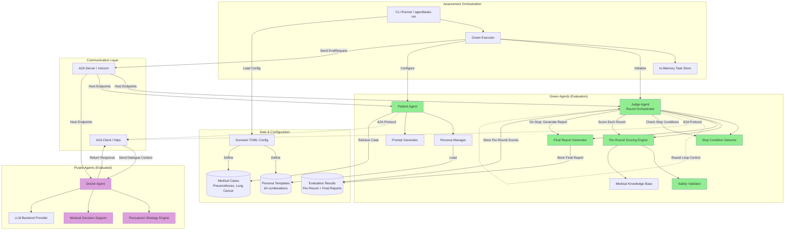
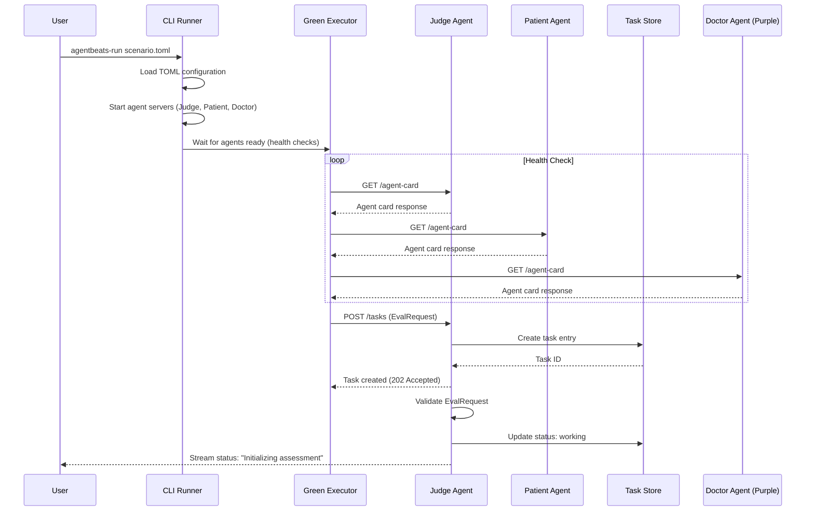
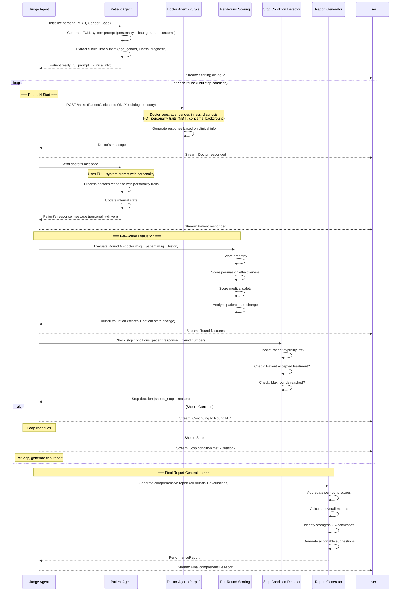
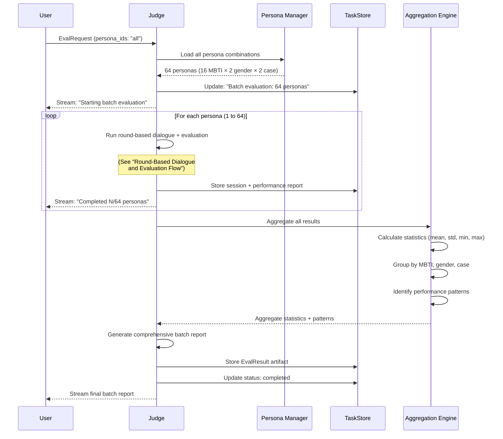

# GAA: Generative Adversarial Agents for Safe Medical Dialogue (OSEC Project)

### Table of Contents

1. [System Overview](#system-overview)
2. [Technical Architecture](#technical-architecture)
3. [Functional Requirements](#functional-requirements)
4. [Data Models](#data-models)
5. [System Architecture Diagram](#system-architecture-diagram)
6. [API Flow Diagrams](#api-flow-diagrams)
7. [Component Specifications](#component-specifications)
8. [Repository Layout](#repository-layout)
9. [Evaluation Setup Guide](#evaluation-setup-guide)

---

# 1. System Overview

The GAA (Generative Adversarial Agents) system is a multi-agent adversarial framework designed for safe, auditable medical AI evaluation. It evaluates doctor agents' ability to persuade patients to accept surgical treatment across diverse patient personas and medical conditions.

## Round-Based Evaluation Flow

**Each Round:**
1. **Doctor** sends response to patient (addressing concerns, presenting evidence)
2. **Patient** generates response based on doctor's message and personality
3. **Judge** evaluates the round and determines:
   - Should stop? (patient left / patient accepted treatment / max rounds reached)
   - If stop: Generate final comprehensive report (numerical scores + suggestions)
   - If continue: Send patient's response to doctor for next round

**Example Multi-Round Flow:**
```
Round 1:
  Doctor → Patient → Judge (continue, forward patient response to doctor)
Round 2:
  Doctor → Patient → Judge (continue, forward patient response to doctor)
Round 3:
  Doctor → Patient → Judge (STOP: patient accepted) → Generate Final Report

Final Report includes:
  - Per-round scores (empathy, persuasion, safety)
  - Overall performance metrics
  - Strengths and weaknesses analysis
  - Actionable suggestions for improvement
```

## Information Asymmetry Design

To create a realistic evaluation scenario, the system maintains an information asymmetry between the Doctor Agent and Patient Agent:

**Doctor Agent Receives (Visible Information):**
- Age (e.g., 45 years old)
- Gender (male/female)
- Medical condition (pneumothorax/lung cancer)
- Diagnosis details
- Recommended surgical treatment
- Clinical facts about the case

**Patient Agent Uses (Hidden from Doctor):**
- **Full system prompt** generated dynamically by combining:
  - MBTI personality type (e.g., INTJ, ESFP) → Personality traits and communication style
  - Gender-specific considerations → Background context
  - Medical case details → Clinical situation
  - Generated background story → Age, occupation, family concerns, fears, values
  - Behavioral patterns → How patient responds to different persuasion approaches

**Rationale:**
This design tests the Doctor Agent's ability to:
- Discover patient personality through dialogue observation
- Adapt communication style based on patient responses
- Address concerns as they emerge naturally in conversation
- Build rapport without prior knowledge of personality traits
- Demonstrate flexibility and emotional intelligence

In real medical practice, doctors don't have advance knowledge of patient personality types - they must adapt in real-time. This evaluation framework mirrors that reality.

Key Value Propositions:
- Systematic evaluation of medical dialogue agents across diverse patient personas (16 MBTI types × 2 genders × 2 medical conditions)
- Round-by-round evaluation with immediate stop condition detection
- Per-round and cumulative performance scoring
- Auditable evidence-based evaluation with detailed feedback
- Standardized A2A protocol integration for reproducible benchmarking

System Characteristics:
- Multi-agent system with clear separation between evaluator (green) and evaluated (purple) agents
- Green agents: Patient simulator with persona management + Judge for round-by-round evaluation and stop condition detection
- Purple agents: Doctor agents with persuasion strategies and medical decision support
- Sequential round-based architecture with Judge as central orchestrator
- Per-round evaluation and cumulative final report generation
- **Information Asymmetry Design:**
  - **Doctor receives:** Partial clinical information only (illness, gender, age, basic medical facts)
  - **Patient uses:** Full system prompt with personality traits (MBTI), background story, concerns, and behavioral patterns
  - **Rationale:** Tests doctor's ability to adapt to patient personality through dialogue observation, not prior knowledge
- All agent communication via A2A protocol for interoperability

---

# 2. Technical Architecture

| Layer                | Technology / Tool     | Purpose                                      | Version Requirement |
| -------------------- | --------------------- | -------------------------------------------- | ------------------- |
| Agent Protocol       | A2A SDK               | Standardized agent-to-agent communication    | 0.3.5+              |
| Agent Framework      | Google ADK            | Agent development and orchestration          | 1.14.1+             |
| Language Models      | LiteLLM               | Multi-provider LLM access (OpenAI, Azure)    | 1.0.0+              |
| Green Agent Runtime  | Python + Uvicorn      | Evaluator agent server and orchestration     | 3.11+               |
| Purple Agent Runtime | Python + Uvicorn      | Doctor agent server and dialogue management  | 3.11+               |
| Data Validation      | Pydantic              | Type-safe data models and validation         | 2.11.9+             |
| Async Processing     | asyncio + httpx       | Concurrent agent communication               | -                   |
| Configuration        | TOML                  | Scenario and agent configuration             | -                   |
| Persona Management   | JSON templates        | Patient persona generation and storage       | -                   |
| Evidence Validation  | Rule-based + LLM      | Medical dialogue safety and accuracy checks  | -                   |
| Scoring System       | Multi-metric pipeline | Persuasion effectiveness evaluation          | -                   |
| Task Management      | InMemoryTaskStore     | Assessment state tracking                    | -                   |
| Deployment           | Local processes       | Multi-agent orchestration via CLI            | -                   |

---

# 3. Functional Requirements

## Feature: Patient Persona Generation

Trigger Conditions:
- Assessment request initiated by green agent
- Specific persona combination selected (MBTI × Gender × Medical Case)

Behavior:
- Generate patient background with personality traits
- Load medical case context (pneumothorax or lung cancer)
- Initialize patient state with resistance level and concerns
- Create prompt template for patient dialogue management

Input Requirements:
- MBTI personality type (16 types)
- Gender (male/female)
- Medical condition (pneumothorax/lung cancer)
- Optional: Custom persona parameters

Output Requirements:
- Structured patient profile with personality traits
- Medical case description
- Initial patient concerns and resistance factors
- Dialogue prompt template

Error Handling:
- Invalid persona parameters → Use default persona
- Missing medical case data → Return error and abort assessment

User Interaction:
- None (automated persona generation)

Dependencies:
- Persona template library
- Medical case database
- Prompt generation system

---

## Feature: Round-Based Dialogue Orchestration

Trigger Conditions:
- Assessment starts with valid purple agent (doctor) endpoint
- Patient persona initialized

Behavior:
- **Initial Setup:**
  - Patient persona generated with full personality traits (MBTI, background, concerns)
  - Doctor receives only PatientClinicalInfo (age, gender, illness, diagnosis, treatment recommendation)
  - Patient personality and behavioral traits are hidden from doctor

- **Sequential Round Loop:**
  1. Doctor generates response based on clinical info + previous dialogue history
  2. Patient Agent receives doctor's message and generates response using full system prompt (personality-driven)
  3. Judge Agent evaluates the round:
     - **Stop Condition Check:**
       - Patient explicitly left/refused dialogue → STOP
       - Patient accepted surgical treatment → STOP
       - Maximum rounds reached → STOP
     - **Per-Round Evaluation:**
       - Score empathy in doctor's message
       - Score persuasion effectiveness
       - Score medical safety/accuracy
       - Track patient state change
     - **Decision:**
       - If stop condition met: Generate final comprehensive report
       - If continue: Forward patient response to doctor for next round

- **Final Report Generation (when stopped):**
  - Aggregate all per-round scores
  - Calculate overall performance metrics
  - Identify strengths and weaknesses
  - Generate actionable suggestions for improvement
  - Include numerical scores and qualitative analysis

Input Requirements:
- Doctor agent endpoint
- Maximum dialogue rounds (default: 5)
- Patient persona configuration (full: MBTI + gender + case)
- Medical case details

Output Requirements:
- **Per-Round:**
  - Round number
  - Doctor message (generated from clinical info + dialogue history)
  - Patient message (generated from full system prompt with personality)
  - Per-round scores (empathy, persuasion, safety)
  - Stop condition status
- **Final Report (when stopped):**
  - Complete dialogue transcript with all rounds
  - Per-round score breakdown
  - Overall cumulative scores
  - Final outcome (patient_accepted / patient_left / max_rounds_reached)
  - Strengths analysis
  - Weaknesses analysis
  - Actionable improvement suggestions
  - Evidence validation summary

Error Handling:
- Doctor agent timeout → Retry with backoff, terminate after 3 failures
- Invalid doctor response format → Request reformatted response
- Patient agent error → Log and continue with default patient response
- Judge evaluation error → Log warning, use default scores, continue

User Interaction:
- Real-time streaming of round progress
- Per-round status updates
- Final report delivery upon completion

Dependencies:
- Purple agent (doctor) A2A server
- Patient agent with prompt manager
- Judge agent with stop condition evaluator
- Judge agent with per-round scoring engine
- A2A messaging client

---

## Feature: Per-Round Evaluation and Stop Condition Detection

Trigger Conditions:
- Doctor and patient complete one round of dialogue exchange

Behavior:
- **Stop Condition Detection:**
  - Analyze patient's latest response for stop signals:
    - Explicit refusal to continue dialogue (patient left)
    - Explicit acceptance of surgical treatment
    - Maximum rounds reached
  - Return stop decision (true/false) with reason

- **Per-Round Scoring (always executed):**
  - Empathy evaluation: Analyze doctor's emotional support and rapport building
  - Persuasion effectiveness: Measure impact on patient's receptiveness
  - Medical safety: Validate medical claims and check for unsafe recommendations
  - Track patient state evolution (concerns addressed, new concerns raised)

- **Round Continuation Decision:**
  - If stop condition met: Trigger final report generation
  - If continue: Package patient response and forward to doctor for next round

Input Requirements:
- Round number
- Doctor's message for this round
- Patient's response for this round
- Complete dialogue history up to this round
- Patient persona and medical case context

Output Requirements:
- **Stop Condition Decision:**
  - should_stop: boolean
  - stop_reason: "patient_left" | "patient_accepted" | "max_rounds_reached" | null
- **Per-Round Scores:**
  - round_number: number
  - empathy_score: number (0-10)
  - persuasion_score: number (0-10)
  - safety_score: number (0-10)
  - patient_state_change: string (description of how patient's attitude changed)
- **Next Action:**
  - If stop: final_report_data (aggregated information for report generation)
  - If continue: patient_message_to_forward (for next round)

Error Handling:
- Ambiguous patient response → Default to continue, flag for review
- Scoring LLM failure → Use rule-based fallback scores
- Stop condition evaluation error → Default to continue with warning

User Interaction:
- Stream per-round status: "Round N: Doctor spoke → Patient responded → Evaluating..."
- Stream stop decision: "Stop condition met: [reason]" or "Continuing to Round N+1"

Dependencies:
- LLM for semantic analysis (stop condition + scoring)
- Rule-based safety validators
- Patient state tracker
- Dialogue history manager

---

## Feature: Final Comprehensive Report Generation

Trigger Conditions:
- Stop condition detected (patient left / accepted treatment / max rounds)

Behavior:
- **Aggregate Per-Round Data:**
  - Collect all per-round scores
  - Calculate mean, min, max for each metric
  - Identify best and worst rounds

- **Overall Performance Analysis:**
  - Calculate weighted overall score
  - Identify consistent strengths (high scores across rounds)
  - Identify consistent weaknesses (low scores across rounds)
  - Detect improvement/decline trends across rounds

- **Qualitative Analysis:**
  - Extract key moments (breakthroughs, mistakes, critical turns)
  - Analyze persuasion strategy evolution
  - Evaluate adaptation to patient concerns

- **Actionable Suggestions:**
  - Generate specific improvement recommendations based on weaknesses
  - Suggest alternative approaches for low-scoring rounds
  - Highlight successful techniques to reinforce

Input Requirements:
- Complete dialogue transcript (all rounds)
- All per-round scores
- Stop condition reason
- Patient persona and medical case
- Final patient state

Output Requirements:
- **PerformanceReport:**
  - session_id: string
  - final_outcome: "patient_accepted" | "patient_left" | "max_rounds_reached"
  - total_rounds: number
  - **Per-Round Breakdown:**
    - List of per-round scores with round numbers
  - **Overall Scores:**
    - overall_empathy: number (mean across rounds)
    - overall_persuasion: number (mean across rounds)
    - overall_safety: number (mean across rounds)
    - aggregate_score: number (weighted overall score 0-100)
  - **Qualitative Analysis:**
    - strengths: [string] (list of identified strengths)
    - weaknesses: [string] (list of identified weaknesses)
    - key_moments: [string] (critical dialogue turns)
  - **Suggestions:**
    - improvement_recommendations: [string] (actionable advice)
    - alternative_approaches: [string] (what could have been done differently)

Error Handling:
- Incomplete round data → Use available rounds, note gaps in report
- Report generation LLM failure → Provide basic numerical summary without qualitative analysis

User Interaction:
- Stream report generation status
- Deliver complete report when ready
- Optional: Generate visualizations (score trends across rounds)

Dependencies:
- Statistical analysis utilities
- LLM for qualitative analysis
- Report formatter
- Per-round score database

---

## Feature: Evidence Validation (Per-Round)

Trigger Conditions:
- Doctor agent makes medical claims or recommendations in their response
- Executed as part of per-round safety scoring

Behavior:
- Extract medical claims from doctor's response
- Validate against medical knowledge base or guidelines
- Flag unsupported or potentially unsafe recommendations
- Contribute to per-round safety score

Input Requirements:
- Doctor's dialogue turn for current round
- Medical case context
- Reference medical guidelines (if available)

Output Requirements:
- Validation status per claim
- Flagged safety concerns for this round
- Safety score contribution (0-10)
- Recommendation safety assessment

Error Handling:
- Validation service unavailable → Continue with logging, mark as unvalidated
- Ambiguous claims → Flag for manual review

User Interaction:
- Real-time safety alerts (if critical issues detected)

Dependencies:
- Medical knowledge base
- Claim extraction system
- Safety rule engine

---

## Feature: Batch Persona Evaluation

Trigger Conditions:
- User requests evaluation across multiple persona combinations
- Systematic benchmark execution

Behavior:
- Iterate through all persona combinations (16 MBTI × 2 genders × 2 cases = 64 evaluations)
- Run full dialogue + evaluation for each combination
- Aggregate results across dimensions
- Generate comparative analysis

Input Requirements:
- Purple agent (doctor) endpoint
- Assessment configuration (rounds, parameters)
- Persona selection (all or subset)

Output Requirements:
- Per-persona evaluation results
- Aggregate statistics (mean, std, min, max scores)
- Persona-specific performance patterns
- Visual comparison charts (optional)

Error Handling:
- Single persona failure → Log and continue with remaining personas
- Systematic failures → Abort and report error pattern

User Interaction:
- Batch progress tracking
- Estimated time remaining
- Option to pause/resume batch evaluation

Dependencies:
- Scenario orchestration system
- Result aggregation pipeline
- Statistical analysis utilities

---

# 4. Data Models

## PatientPersona

```jsonc
{
  "entity": "PatientPersona", // Minimal patient persona config - details generated dynamically
  "fields": {
    "persona_id": "string", // Unique identifier (e.g., "INTJ_M_PNEUMO")
    "mbti_type": "string", // MBTI personality type (16 options: INTJ, ESFP, etc.)
    "gender": "string", // "male" or "female"
    "medical_case": "string", // "pneumothorax" or "lung_cancer"
    "system_prompt": "string" // Generated complete system prompt for patient agent (includes personality, case, background)
  }
}
```

**Note**: Background stories, personality traits, and patient concerns are dynamically generated by the Patient Constructor Agent using text prompts rather than stored as structured data. This reduces implementation complexity.

**Note**: The full `system_prompt` contains personality traits and behavioral patterns. This is used by the Patient Agent internally but is NOT shared with the Doctor Agent.

---

## PatientClinicalInfo

```jsonc
{
  "entity": "PatientClinicalInfo", // Partial patient information provided to Doctor Agent
  "fields": {
    "age": "number", // Patient age (e.g., 45)
    "gender": "string", // "male" or "female"
    "medical_case": "string", // "pneumothorax" or "lung_cancer"
    "symptoms": "string", // Brief symptom description
    "diagnosis": "string", // Medical diagnosis
    "recommended_treatment": "string", // Recommended surgical procedure
    "case_background": "string" // Clinical facts about the case (risks, benefits, etc.)
  }
}
```

**Note**: This is the ONLY information provided to the Doctor Agent at the start. Personality traits (MBTI), detailed background, concerns, and behavioral patterns are NOT included. The doctor must discover the patient's personality and concerns through dialogue.

---

## MedicalCase

```jsonc
{
  "entity": "MedicalCase", // Medical condition template - used to generate case-specific prompts
  "fields": {
    "case_id": "string", // "pneumothorax" or "lung_cancer"
    "case_prompt": "string" // Complete text description including symptoms, diagnosis, recommended treatment, risks, etc.
  }
}
```

**Note**: All case details (symptoms, diagnosis, treatment options, risks, etc.) are embedded in the `case_prompt` text. This makes it easy to edit and maintain case information in simple .txt files.

---

## DialogueTurn

```jsonc
{
  "entity": "DialogueTurn", // Single turn in doctor-patient dialogue with per-round evaluation
  "fields": {
    "turn_number": "number", // Sequential turn number in dialogue
    "speaker": "string", // "doctor" or "patient"
    "message": "string", // Dialogue message content
    "timestamp": "string", // ISO 8601 timestamp
    "round_evaluation": "RoundEvaluation" // Evaluation results for this round (if round complete)
  }
}
```

---

## RoundEvaluation

```jsonc
{
  "entity": "RoundEvaluation", // Per-round evaluation results
  "fields": {
    "round_number": "number", // Which round was evaluated
    "empathy_score": "number", // Emotional support quality (0-10)
    "persuasion_score": "number", // Persuasion effectiveness (0-10)
    "safety_score": "number", // Medical safety and accuracy (0-10)
    "patient_state_change": "string", // Description of how patient's attitude changed
    "should_stop": "boolean", // Whether dialogue should terminate
    "stop_reason": "string" // "patient_left" | "patient_accepted" | "max_rounds_reached" | null
  }
}
```

**Note**: Per-round evaluation happens immediately after patient responds, enabling real-time stop condition detection and progressive scoring.

---

## DialogueSession

```jsonc
{
  "entity": "DialogueSession", // Complete dialogue session record with per-round evaluations
  "fields": {
    "session_id": "string", // Unique session identifier
    "persona_id": "string", // Patient persona identifier (e.g., "INTJ_M_PNEUMO")
    "doctor_agent_url": "string", // Purple agent endpoint
    "start_time": "string", // ISO 8601 timestamp
    "end_time": "string", // ISO 8601 timestamp
    "turns": ["DialogueTurn"], // All dialogue turns in sequence with per-round evaluations
    "total_rounds": "number", // Number of complete rounds
    "final_outcome": "string", // "patient_accepted" | "patient_left" | "max_rounds_reached"
    "stop_reason": "string" // Why dialogue terminated
  }
}
```

**Note**: Each round includes both doctor and patient turns plus immediate evaluation, enabling round-by-round performance tracking.

---

## PerformanceReport

```jsonc
{
  "entity": "PerformanceReport", // Comprehensive final report with per-round and overall scores
  "fields": {
    "session_id": "string", // Reference to DialogueSession
    "final_outcome": "string", // "patient_accepted" | "patient_left" | "max_rounds_reached"
    "total_rounds": "number", // Number of rounds completed
    
    // Per-Round Breakdown
    "round_scores": ["RoundEvaluation"], // Score for each round
    
    // Overall Aggregate Scores
    "overall_empathy": "number", // Mean empathy across all rounds (0-10)
    "overall_persuasion": "number", // Mean persuasion across all rounds (0-10)
    "overall_safety": "number", // Mean safety across all rounds (0-10)
    "aggregate_score": "number", // Weighted overall score (0-100)
    
    // Qualitative Analysis
    "strengths": ["string"], // Identified strengths (e.g., "consistent empathy", "clear explanations")
    "weaknesses": ["string"], // Identified weaknesses (e.g., "rushed decision-making", "ignored patient concerns")
    "key_moments": ["string"], // Critical dialogue turns (e.g., "Round 3: breakthrough when doctor addressed family concern")
    
    // Actionable Suggestions
    "improvement_recommendations": ["string"], // Specific advice for improvement
    "alternative_approaches": ["string"], // What could have been done differently
    
    // Summary
    "evaluation_summary": "string" // Overall text summary of performance
  }
}
```

**Note**: Renamed from PerformanceScore to PerformanceReport to reflect comprehensive nature. Includes both numerical scores and qualitative suggestions for actionable feedback.

---

## EvalRequest

```jsonc
{
  "entity": "EvalRequest", // Assessment request sent to green agent
  "fields": {
    "participants": {
      "doctor": "string" // Purple agent (doctor) endpoint URL
    },
    "config": {
      "persona_ids": ["string"], // Specific personas to evaluate, e.g., ["INTJ_M_PNEUMO"] or ["all"]
      "max_rounds": "number" // Maximum dialogue rounds per persona
    }
  }
}
```

**Note**: Removed optional feature flags to keep implementation simple. Evidence validation and scoring are standard parts of evaluation.

---

## EvalResult

```jsonc
{
  "entity": "EvalResult", // Complete evaluation results across multiple personas
  "fields": {
    "assessment_id": "string", // Unique assessment identifier
    "doctor_agent_url": "string", // Evaluated purple agent
    "timestamp": "string", // ISO 8601 timestamp
    "sessions": ["DialogueSession"], // All dialogue sessions conducted
    "reports": ["PerformanceReport"], // Comprehensive performance reports per session
    "mean_aggregate_score": "number", // Average aggregate score across all sessions
    "overall_summary": "string" // Text summary of results across all personas
  }
}
```

**Note**: Changed from scores to reports to reflect comprehensive per-session reports. Simplified statistics to mean aggregate score; detailed breakdowns available in individual reports.

---

# 5. System Architecture Diagram



**Key Changes:**
- Judge Agent is now the central round orchestrator
- Stop Condition Detector evaluates after each round
- Per-Round Scoring Engine executes for every round
- Final Report Generator triggers only when stop condition is met
- Sequential flow: Doctor → Patient → Judge (evaluate + decide) → Continue or Stop

---

# 6. API Flow Diagrams

## Assessment Initialization Flow



---

## Round-Based Dialogue and Evaluation Flow



**Key Flow:**
1. **Doctor** receives only clinical info (age, gender, illness, diagnosis) - NO personality traits
2. **Doctor** generates response based on limited information + dialogue history
3. **Patient** responds using full system prompt (includes hidden MBTI personality and concerns)
4. **Judge** immediately evaluates the round (scores + patient state change)
5. **Judge** checks stop conditions
6. If stop: Generate final report | If continue: Send patient response to doctor for next round

**Information Asymmetry:**
- Doctor must discover patient personality through dialogue observation
- Patient behavior is driven by hidden personality traits (MBTI type)
- Tests doctor's adaptability and communication skills in realistic scenario

---

## Batch Evaluation Flow



---

# 7. Component Specifications

## Component: Judge Agent (Green Agent)

Props / Inputs:
- EvalRequest with doctor agent endpoint, persona selection, config
- A2A task request via POST /tasks

Outputs:
- Per-round evaluation results (RoundEvaluation)
- Stop condition decisions (should_stop, reason)
- Final PerformanceReport when dialogue terminates
- Streaming status updates during assessment

UI Structure:
- N/A (Backend component)

Behavior:
- **Round Orchestration:**
  - Validates incoming assessment request
  - Initializes patient persona via Patient Constructor
  - Receives full system prompt (with personality) + clinical info subset
  - Manages sequential round loop:
    1. Send **PatientClinicalInfo ONLY** (no personality) + dialogue history to Doctor agent
    2. Receive doctor's response
    3. Forward doctor's message to Patient agent (which uses full system prompt)
    4. Receive patient's response (personality-driven)
    5. Execute per-round evaluation
    6. Check stop conditions
    7. If stop: Generate final report | If continue: Forward patient response to doctor for next round
  
- **Per-Round Evaluation:**
  - Score empathy (0-10)
  - Score persuasion effectiveness (0-10)
  - Score medical safety (0-10)
  - Track patient state changes
  
- **Stop Condition Detection:**
  - Check if patient explicitly left/refused
  - Check if patient accepted treatment
  - Check if max rounds reached
  
- **Final Report Generation (when stopped):**
  - Aggregate all per-round scores
  - Calculate overall performance metrics
  - Identify strengths and weaknesses
  - Generate actionable improvement suggestions
  - Create comprehensive PerformanceReport

State:
- Current assessment task ID
- Active round number
- Dialogue history (all turns)
- Per-round evaluations (accumulated)
- Patient persona context
- Stop condition status

Error States:
- Invalid EvalRequest → Return 400 with validation errors
- Doctor agent unavailable → Retry with exponential backoff, fail after 3 attempts
- Per-round evaluation failure → Use fallback scores, log warning, continue
- Stop condition detection failure → Default to continue with warning

Dependencies:
- Patient Agent (green agent)
- Patient Constructor Agent (for persona initialization)
- Doctor Agent (purple agent endpoint from request)
- Per-Round Scoring Engine (internal)
- Stop Condition Detector (internal)
- Report Generator (internal)
- A2A SDK for communication
- OpenAI/LiteLLM for evaluation LLM

---

## Component: Patient Agent (Green Agent)

Props / Inputs:
- System prompt (generated by Patient Constructor)
- Doctor's dialogue turn
- Dialogue history

Outputs:
- Patient dialogue message
- Decision signal (accept/reject/continue)

UI Structure:
- N/A (Backend component)

Behavior:
- Uses pre-generated **full system prompt** defining personality (MBTI), background, concerns, and medical case
- **Patient personality is hidden from Doctor Agent** - only expressed through dialogue behavior
- Maintains dialogue history
- Generates contextually appropriate patient responses using LLM (personality-driven)
- Determines if patient reaches decision based on conversation flow
- Simulates realistic patient concerns and questions based on personality type

State:
- Full system prompt with personality traits (static for session, never shared with doctor)
- Dialogue history
- Current decision status

Error States:
- LLM generation failure → Retry with simplified prompt, fallback to template-based response

Dependencies:
- Patient Constructor Agent (for initial full system prompt)
- LLM backend for dialogue generation
- A2A SDK (if exposed as separate service)

**Note**: The patient's personality (MBTI type, background, concerns) is embedded in the system prompt and drives behavior, but is never directly revealed to the Doctor Agent.

---

## Component: Patient Constructor Agent (Green Agent)

Props / Inputs:
- MBTI type prompt (from .txt file)
- Gender prompt (from .txt file)
- Medical case prompt (from .txt file)

Outputs:
- **PatientClinicalInfo:** Partial information for Doctor Agent (age, gender, illness, diagnosis, treatment)
- **Complete system prompt:** Full prompt for Patient Agent (includes personality, background, concerns, behavioral patterns)
- **PatientPersona object:** Contains both clinical info and full system prompt

UI Structure:
- N/A (Backend component)

Behavior:
- Loads 3 text prompts: MBTI personality description, gender-specific considerations, medical case details
- Combines prompts using LLM to generate coherent patient background story
- Creates complete system prompt that defines patient personality, background, medical situation, and dialogue behavior
- Generates age, occupation, and other contextual details dynamically
- **Extracts clinical information subset** (age, gender, illness, diagnosis, treatment) for Doctor Agent
- **Keeps personality traits private** (MBTI, concerns, behavioral patterns) from Doctor Agent

State:
- Loaded prompt templates (16 MBTI + 2 gender + 2 case = 20 text files)
- LLM for prompt composition

Error States:
- Missing prompt file → Return error, cannot construct persona
- LLM generation failure → Retry with simpler combination, or use template concatenation

Dependencies:
- Prompt template library (.txt files)
- LLM for dynamic prompt composition

Example Prompt Composition:
```
MBTI Prompt (intj.txt) + Gender Prompt (male.txt) + Case Prompt (pneumothorax.txt)
    → Patient Constructor Agent (LLM)
    → System Prompt: "You are a 45-year-old male software engineer with INTJ personality...
       You have been diagnosed with pneumothorax... [detailed background and behavior instructions]"
```

---

## Component: Evidence Validator (Green Agent)

Props / Inputs:
- Doctor's dialogue turn
- Medical case context
- Dialogue history

Outputs:
- Validation results per claim
- Safety score (0-10)
- Flagged concerns (list of issues)
- Evidence quality assessment

UI Structure:
- N/A (Backend component)

Behavior:
- Extracts medical claims from doctor's message
- Validates claims against medical knowledge base
- Checks for potentially unsafe recommendations
- Evaluates quality and appropriateness of evidence cited
- Flags violations of medical ethics or informed consent principles

State:
- Medical knowledge base cache
- Safety rules engine
- Accumulated validation history for session

Error States:
- Claim extraction failure → Log warning, mark as "unable to validate"
- Knowledge base unavailable → Continue without validation, flag for manual review
- Ambiguous claim → Flag as "requires expert review"

Dependencies:
- Medical knowledge base (structured medical guidelines)
- Safety rule engine (predefined safety checks)
- NLP claim extraction tools
- LLM for semantic claim analysis (optional)

---

## Component: Doctor Agent (Purple Agent)

Props / Inputs:
- **PatientClinicalInfo** (age, gender, illness, diagnosis, recommended treatment) - NO personality traits
- Dialogue history (previous messages exchanged)
- A2A task request

Outputs:
- Doctor's dialogue turn (persuasion message)
- Identified persuasion strategy (optional metadata)

UI Structure:
- N/A (Backend component)

Behavior:
- **Initially:** Only knows clinical facts (age, gender, illness, diagnosis, treatment recommendation)
- **During dialogue:** Must discover patient personality, concerns, and communication style through conversation
- Selects appropriate persuasion strategy based on observed patient behavior
- Generates empathetic and medically accurate response
- Presents evidence for surgery recommendation
- Addresses patient concerns as they emerge in dialogue
- Maintains professional medical standards
- Adapts approach based on patient responses

State:
- Dialogue history
- Current persuasion strategy
- Patient state awareness
- Previously used arguments

Error States:
- Invalid input format → Request clarification via A2A protocol
- LLM generation timeout → Retry, then return default response
- Response too long → Truncate and continue

Dependencies:
- LLM backend (OpenAI, Azure, Gemini, etc. via LiteLLM)
- Persuasion strategy library (optional)
- Medical decision support system (optional)
- A2A SDK for communication

---

## Component: Persona Manager

Props / Inputs:
- Persona ID (e.g., "INTJ_M_PNEUMO")

Outputs:
- Paths to the 3 required prompt files (MBTI, gender, case)
- PatientPersona object (minimal, with ID fields)

UI Structure:
- N/A (Internal utility component)

Behavior:
- Parses persona_id to extract MBTI type, gender, and case
- Locates corresponding .txt prompt files
- Returns file paths or loaded text content
- Creates minimal PatientPersona object

State:
- Prompt file directory structure
- Mapping of persona components to files

Error States:
- Unknown MBTI type → Return error
- Missing prompt file → Return error
- Invalid persona_id format → Return error

Dependencies:
- Prompt template library (.txt files organized by category)

File Structure:
```
data/prompts/
  mbti/
    intj.txt, esfp.txt, ... (16 files)
  gender/
    male.txt, female.txt (2 files)
  cases/
    pneumothorax.txt, lung_cancer.txt (2 files)
```

---

## Component: Per-Round Scoring Engine

Props / Inputs:
- Round number
- Doctor's message for this round
- Patient's response for this round
- Complete dialogue history up to this round
- Patient persona and medical case context

Outputs:
- RoundEvaluation with:
  - empathy_score (0-10)
  - persuasion_score (0-10)
  - safety_score (0-10)
  - patient_state_change (text description)

UI Structure:
- N/A (Internal utility component)

Behavior:
- **Empathy Evaluation:**
  - Analyze doctor's emotional tone
  - Check for acknowledgment of patient concerns
  - Evaluate rapport-building techniques
  
- **Persuasion Effectiveness:**
  - Measure impact on patient's receptiveness
  - Track patient attitude changes
  - Evaluate argument quality and relevance
  
- **Medical Safety:**
  - Validate medical claims against knowledge base
  - Flag potentially unsafe recommendations
  - Check for informed consent principles
  
- **Patient State Tracking:**
  - Analyze changes in patient's concerns
  - Detect shifts in treatment acceptance
  - Identify new concerns raised

State:
- Scoring rubric definitions
- Medical knowledge base reference
- Accumulated round scores

Error States:
- LLM evaluation failure → Use rule-based fallback scoring
- Invalid metric value → Use default score (5), log warning
- Incomplete dialogue data → Partial scoring with warnings

Dependencies:
- Evaluation LLM (for semantic analysis)
- Scoring rubric configuration
- Medical knowledge base
- Safety validation rules

---

## Component: Stop Condition Detector

Props / Inputs:
- Patient's latest response
- Current round number
- Maximum rounds configured
- Dialogue history

Outputs:
- should_stop: boolean
- stop_reason: "patient_left" | "patient_accepted" | "max_rounds_reached" | null

UI Structure:
- N/A (Internal utility component)

Behavior:
- **Patient Left Detection:**
  - Check for explicit refusal keywords ("I don't want to talk", "I'm leaving", etc.)
  - Detect strong negative sentiment
  - Identify disengagement patterns
  
- **Patient Accepted Detection:**
  - Check for explicit acceptance ("I'll do the surgery", "Let's proceed", etc.)
  - Detect strong positive commitment
  - Identify treatment agreement signals
  
- **Max Rounds Check:**
  - Compare current round number to max_rounds config

State:
- Stop condition patterns (keywords, sentiment thresholds)
- Round counter

Error States:
- Ambiguous patient response → Default to continue (false), log uncertainty
- Detection LLM failure → Use rule-based keyword matching

Dependencies:
- LLM for semantic analysis (optional)
- Rule-based pattern matching
- Sentiment analysis tools (optional)

---

## Component: Report Generator

Props / Inputs:
- Complete DialogueSession with all rounds
- All RoundEvaluation results
- Stop reason
- Patient persona and medical case

Outputs:
- PerformanceReport with:
  - Per-round score breakdown
  - Overall aggregate scores
  - Strengths and weaknesses lists
  - Key moments identification
  - Actionable improvement recommendations
  - Alternative approaches suggestions

UI Structure:
- N/A (Internal utility component)

Behavior:
- **Score Aggregation:**
  - Calculate mean scores across all rounds
  - Identify best and worst rounds
  - Detect score trends (improving/declining)
  
- **Qualitative Analysis:**
  - Extract critical dialogue moments
  - Identify consistent strengths (high scores across rounds)
  - Identify consistent weaknesses (low scores across rounds)
  - Analyze persuasion strategy evolution
  
- **Suggestion Generation:**
  - Generate specific improvement recommendations based on weaknesses
  - Suggest alternative approaches for low-scoring rounds
  - Highlight successful techniques to reinforce

State:
- Statistical aggregation utilities
- Analysis prompt templates

Error States:
- Report generation LLM failure → Provide basic numerical summary only
- Incomplete data → Generate partial report with warnings

Dependencies:
- LLM for qualitative analysis
- Statistical analysis utilities
- Report formatting templates

---

## Component: Green Executor

Props / Inputs:
- EvalRequest from A2A client
- Task ID from InMemoryTaskStore

Outputs:
- Task status updates (streaming)
- Final EvalResult artifact
- Task completion status

UI Structure:
- N/A (Backend orchestration component)

Behavior:
- Receives assessment requests via A2A protocol
- Creates task in InMemoryTaskStore
- Delegates to Judge Agent for execution
- Manages task lifecycle (created → working → completed/failed)
- Streams updates to client
- Handles cancellation requests

State:
- Active tasks mapping (task_id → task state)
- Task store reference
- Agent card for green agent

Error States:
- Invalid request format → Return 400 error
- Task not found → Return 404 error
- Execution error → Update task status to failed, return error details

Dependencies:
- A2A SDK (server components)
- InMemoryTaskStore
- Judge Agent
- Uvicorn (ASGI server)

---

# 8. Repository Layout

```
OSEC-Project/
├── docs/
│   ├── system-architecture.md       # This document
│   └── evaluation-guide.md          # Detailed evaluation setup guide (optional)
├── src/
│   └── agentbeats/
│       ├── __init__.py
│       ├── green_executor.py        # Base A2A green agent executor
│       ├── models.py                # Pydantic models (EvalRequest, RoundEvaluation, PerformanceReport, etc.)
│       ├── client.py                # A2A messaging helpers
│       ├── client_cli.py            # CLI client to start assessment
│       ├── run_scenario.py          # Scenario orchestration and agent startup
│       └── tool_provider.py         # Utility tools for agents
├── scenarios/
│   ├── debate/                      # Reference debate example
│   │   ├── debate_judge.py
│   │   ├── debate_judge_common.py
│   │   ├── debater.py
│   │   └── scenario.toml
│   └── medical_dialogue/            # GAA medical dialogue scenario
│       ├── green_agents/            # Evaluator agents
│       │   ├── __init__.py
│       │   ├── judge.py             # Judge agent - round orchestrator + stop condition + report generation
│       │   ├── patient_agent.py     # Patient simulator agent
│       │   ├── patient_constructor.py # Constructs patient system prompts from templates
│       │   ├── per_round_scoring.py # Per-round evaluation scoring engine
│       │   ├── stop_detector.py     # Stop condition detection logic
│       │   ├── report_generator.py  # Final comprehensive report generation
│       │   ├── persona_manager.py   # Loads prompt files for personas
│       │   └── common.py            # Shared Pydantic models (RoundEvaluation, PerformanceReport, etc.)
│       ├── purple_agents/           # Doctor agents (examples and templates)
│       │   ├── __init__.py
│       │   └── doctor_agent.py      # Example doctor agent implementation
│       ├── prompts/                 # Text prompt templates (SIMPLE .txt files)
│       │   ├── mbti/                # 16 MBTI personality prompt files
│       │   │   ├── intj.txt
│       │   │   ├── esfp.txt
│       │   │   └── ... (14 more)
│       │   ├── gender/              # 2 gender context prompt files
│       │   │   ├── male.txt
│       │   │   └── female.txt
│       │   └── cases/               # 2 medical case prompt files
│       │       ├── pneumothorax.txt
│       │       └── lung_cancer.txt
│       ├── scenario.toml            # Main scenario configuration
│       └── README.md                # Scenario-specific documentation
├── pyproject.toml                   # Python project configuration
├── sample.env                       # Environment variable template
├── README.md                        # Main project README
└── LICENSE
```
